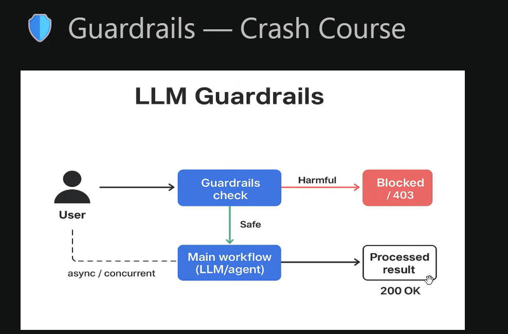
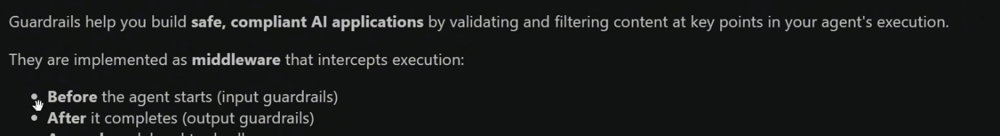
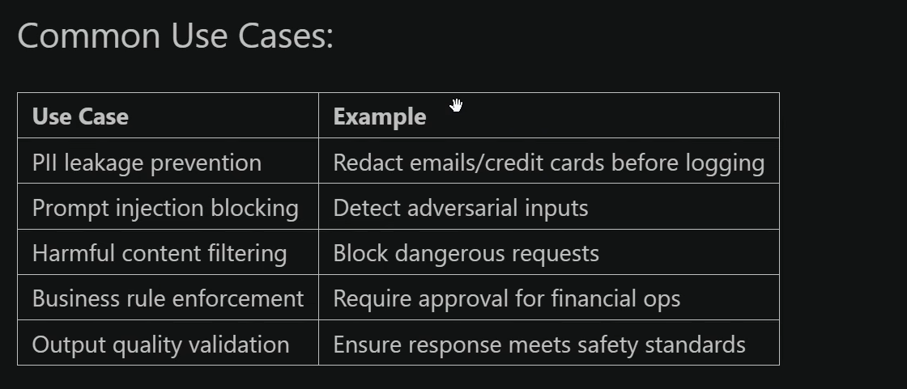
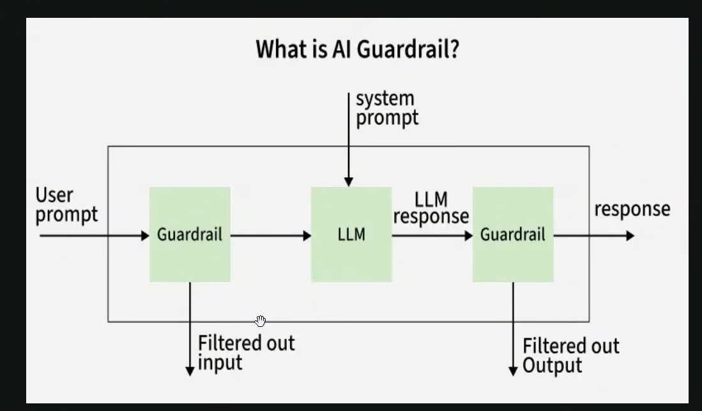
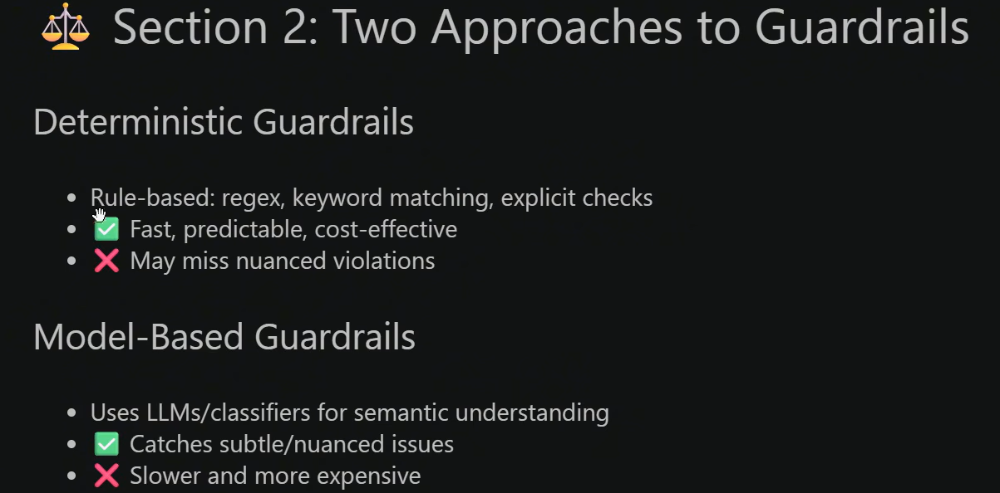
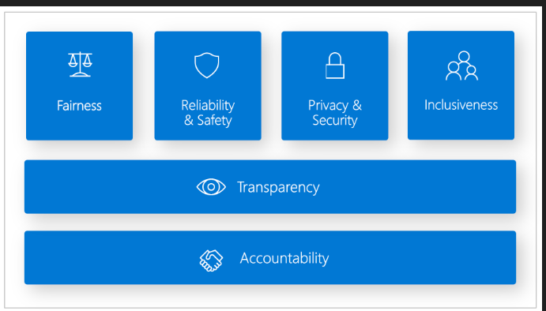

# Guardrails Workshop

A hands-on Python workshop for adding validation and safety checks to LLM outputs. The examples use Pydantic, Instructor, Groq, and Guardrails AI to show how an application can reject unsafe content, enforce a response schema, retry invalid generations, and detect personally identifiable information.

## What You Will Learn

- Validate model output locally with Pydantic.
- Wrap Groq responses with Instructor and a Pydantic response model.
- Enforce structured JSON fields and allowed values.
- Use retries to let the model correct an invalid response.
- Detect and fix email addresses in generated support responses with Guardrails AI.

## Core Mental Model

Prompt engineering asks a model to format or constrain its response. A structured guardrail enforces a software contract after generation by validating the result before downstream code or the user receives it.

Guardrails can be applied at both ends of an LLM pipeline:

- **Input guardrails** reject or redirect requests that violate the application's topic or policy.
- **Output guardrails** validate, redact, repair, or reject the generated response.

## Validator Strategies

Choose the validator based on the complexity of the rule:

| Strategy | Strength | Trade-off |
| --- | --- | --- |
| Rule-based checks, regex, and schema parsers | Fast, local, and inexpensive | Rigid; exact matching can miss indirect wording or misspellings |
| Secondary classifier models | Focused classification of a specific risk | Adds model latency and operational cost |
| LLM-as-a-judge | Handles nuanced semantic decisions | Slowest and most expensive; requires careful evaluation |

Keyword checks in this workshop are intentionally simple and deterministic. Production topical controls may combine them with embeddings, classifiers, or a second model when indirect meaning matters.

### How Validators Work

Validators sit between the model and the rest of the application. They inspect the generated content, attempt to parse it into the expected type, and either pass a valid result onward or trigger a configured failure action. The technology should match the risk and complexity of the rule:

- **Rule-based and heuristic checks:** Python functions, regular expressions, length checks, and JSON parsers run locally with very low latency and no model cost. They are rigid and can miss meaning expressed indirectly.
- **Secondary classifier models:** A focused model returns a classification such as safe/unsafe or toxic/clean. This is more flexible than keyword matching, with moderate latency and cost.
- **LLM-as-a-judge:** A second LLM evaluates nuanced policy questions, such as whether a response gives unauthorized financial advice. This handles semantic cases but increases latency, cost, and operational complexity.

## Failure Remediation

When a validator fails, the pipeline generally takes one of these actions:

- **Hard block:** discard the response and return a safe fallback.
- **Soft fix:** redact or filter the invalid content, such as replacing an email address with `[EMAIL_REDACTED]`.
- **Automated retry:** send the validation error back to the model and request a corrected response.
- **Static fallback payload:** return a known-safe object when parsing or retries continue to fail.

The labs demonstrate all three primary behaviors: blocking competitor mentions, fixing PII, and retrying invalid structured output.

### Remediation Decision Guide

| Failure type | Recommended response | Example |
| --- | --- | --- |
| Toxic, prohibited, or disallowed content | Hard block and return a safe fallback | Replace a disallowed answer with a refusal or support handoff |
| Detectable sensitive data | Redact or filter the content | Replace an email address with `[EMAIL_REDACTED]` |
| Minor JSON or schema mistake | Retry with the validation error | Ask the model to add a missing field or correct a type |
| Repeated failure after retries | Return a static fallback payload | `{"status": "ERROR", "data": null}` |

Retries should have a finite limit. They are useful for recoverable formatting errors, but they should not be used to repeatedly regenerate prohibited content.

## Topical Restrictions

Topical controls limit what an assistant may discuss or how it should respond. A system prompt alone is the weakest control because prompt injection, jailbreaks, and subtle wording can bypass it. Stronger systems combine multiple layers:

| Mechanism | Description | Speed and cost | Accuracy and vulnerability |
| --- | --- | --- | --- |
| System prompting | Tell the model to answer only within an allowed topic | No extra cost; immediate | Lowest; easy to bypass |
| Keyword or regex matching | Scan for exact forbidden terms such as competitor names | Extremely fast, around 1 ms; no model cost | Low; misses euphemisms, misspellings, and indirect references |
| Semantic routing | Compare embeddings with allowed and blocked topic clusters | Fast, roughly 10-30 ms; inexpensive | High for intent and multilingual variation |
| Secondary classifier or LLM judge | Ask a focused model to classify topic alignment | Slower, roughly 50-300 ms; small model/API cost | Highest for subtle context, with added latency and cost |

Topical restrictions should run on both sides of the LLM call:

1. **Before generation:** reject or redirect an out-of-scope user request immediately.
2. **After generation:** inspect the model response before displaying it or passing it to another service.

When an input violates the policy, the application can return a fast rejection or guide the user back to an allowed topic. When an output violates the policy, discard it and show a static safe response rather than exposing the generated text.

## Structural Guardrails

Structured guardrails can be enforced at different levels:

1. **Post-generation parsing and schema validation:** Pydantic, Instructor, and Guardrails AI parse the generated text into a defined Python object.
2. **Self-correction loops:** the framework retries with the validation error when the output is almost correct but has a missing field or minor formatting problem.
3. **Constrained decoding:** tools such as Outlines, Guidance, vLLM, or provider-native structured outputs constrain token generation to a grammar. This is the strongest option when supported by the inference stack.

For downstream services, always define what happens after the maximum retry count: a controlled error or a static fallback is safer than passing malformed data onward.

### Structural Failure Handling

- **Schema healing or JSON repair:** use a parser utility to correct small issues such as missing quotes, trailing commas, or an unclosed bracket when the repair is unambiguous.
- **Targeted re-prompting:** return the exact validation trace, such as `Field 'age' expected an integer, but got string 'thirty-two'`, and ask the model to regenerate only the invalid structure.
- **Static fallback:** return a known-safe object when repair and retries fail, so downstream services do not receive an unhandled parsing exception.

## Reference Visuals

The following images are embedded reference material from the workshop document. They are kept as separate PNGs so they can be viewed directly from the repository:

| Reference | Image |
| --- | --- |
| Guardrails reference 1 |  |
| Guardrails reference 2 |  |
| Guardrails reference 3 |  |
| Guardrails reference 4 |  |
| Guardrails reference 5 |  |
| Guardrails reference 6 |  |

## Student Takeaway

Use this rule when designing an LLM integration:

> Prompt engineering asks the model to format its response; structured guardrails force the model to adhere to a software contract.

## Project Structure

| File | Description |
| --- | --- |
| `lab1_validator.py` | Standalone topical guardrail that blocks competitor names. |
| `lab2_groq_wrap.py` | Calls Groq through Instructor and validates the response. |
| `lab3_structured_guardrail.py` | Requires a structured support payload with sentiment and escalation fields. |
| `lab4_full_pipeline.py` | Runs clean, blocked, and retry-enabled support scenarios. |
| `lab5_Gurdrails_ai_scenarios.py` | Uses Guardrails AI and the PII validator to inspect support output. |
| `requirements.txt` | Python dependencies for the workshop. |
| `docs/Docs on the Guardrails.docx` | Workshop notes on validator mechanisms, topical restrictions, structural guardrails, and remediation. |

## Prerequisites

- Python 3.10 or newer.
- A Groq API key for Labs 2-4.
- Internet access when running the Groq examples or installing packages.

## Setup

Create and activate a virtual environment from the project directory:

### Windows PowerShell

```powershell
python -m venv .venv
.\.venv\Scripts\Activate.ps1
python -m pip install --upgrade pip
pip install -r requirements.txt
```

Set the Groq key for the current PowerShell session:

```powershell
$env:GROQ_API_KEY = "your-groq-api-key"
```

Do not commit API keys or other secrets to the repository. A local `.env` file can be used for personal configuration, but the scripts currently read `GROQ_API_KEY` from the process environment.

## Run the Labs

Run each example from the project root:

```powershell
python lab1_validator.py
python lab2_groq_wrap.py
python lab3_structured_guardrail.py
python lab4_full_pipeline.py
python lab5_Gurdrails_ai_scenarios.py
```

Lab 1 does not require an API key. Labs 2-4 call Groq and therefore require `GROQ_API_KEY`. Lab 5 parses sample JSON locally, but requires the Guardrails AI and PII-validator packages from `requirements.txt`.

## Lab Overview

### Lab 1: Basic Pydantic Validator

`TopicalGuardrail` validates a response string and raises an error when it contains `RivalTech` or `MegaCorp`. This is the smallest example of a guardrail: validate the output before it reaches the user.

### Lab 2: Groq with Instructor

Instructor connects a Groq chat completion to the `SupportResponse` Pydantic model. If the generated message mentions `RivalTech`, validation fails and the script reports that the response was blocked.

### Lab 3: Structured Output

`CustomerSupportPayload` requires three fields:

- `customer_message`
- `sentiment`
- `escalate_to_human`

The model also normalizes sentiment to `POSITIVE`, `NEUTRAL`, or `NEGATIVE` and blocks competitor names in the customer message.

### Lab 4: Full Pipeline and Retries

`SupportTicketResponse` combines a response schema with a topical guardrail. The examples compare a clean request, a hard failure with no retries, and an auto-healed response with two retries. Retries can help the model correct invalid output, but they should not replace clear validation rules or sensible retry limits.

### Lab 5: Guardrails AI and PII

The Guardrails AI example parses raw JSON into a Pydantic model and applies `DetectPII` to the `resolution` field. Email addresses are configured with `on_fail="fix"`, while malformed non-JSON output demonstrates a hard structural failure.

## Expected Results

- Clean examples print a passed or validated response.
- Forbidden competitor names are rejected by a Pydantic validator.
- Invalid sentiment values are rejected or normalized according to the model rules.
- Lab 4 shows the difference between immediate failure and retry-based recovery.
- Lab 5 masks or fixes detected email addresses and rejects malformed JSON.

## Troubleshooting

### `GROQ_API_KEY is not set`

Set the variable in the same PowerShell window used to run the script:

```powershell
$env:GROQ_API_KEY = "your-groq-api-key"
```

### Import errors

Confirm that the virtual environment is active and reinstall the dependencies:

```powershell
python -m pip install -r requirements.txt
```

### Model errors from Groq

The examples use `openai/gpt-oss-120b`. If that model is unavailable for your Groq account, update the `model` value in Labs 2-4 to a model currently supported by your account.

## Important Note

Guardrails should be treated as one layer in a production system. Validate both model input and output, keep secrets out of source control, log blocked responses without leaking sensitive data, and add application-specific tests for every policy that matters.